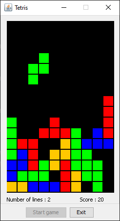

# Tetris

Tetris game in Java.

**Controls:** 
Key [←] - move figure to the left 
Key [→]  - move figure to the right 
Key [↑]  - rotate figure 
Key [↓]  - move figure by 1 cell down 
Key [SPACE] - drop figure 

After reaching the end of the game it saves date, lines, score to the resultScores.txt file in the current directory.